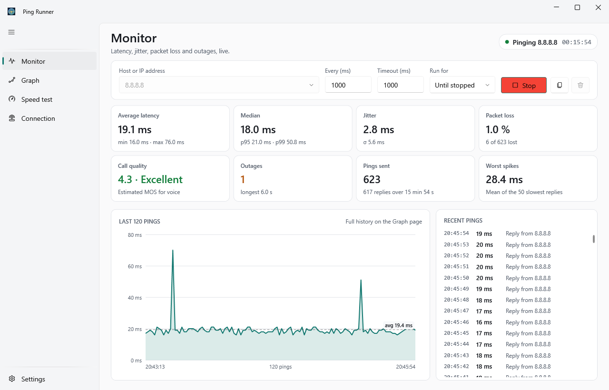
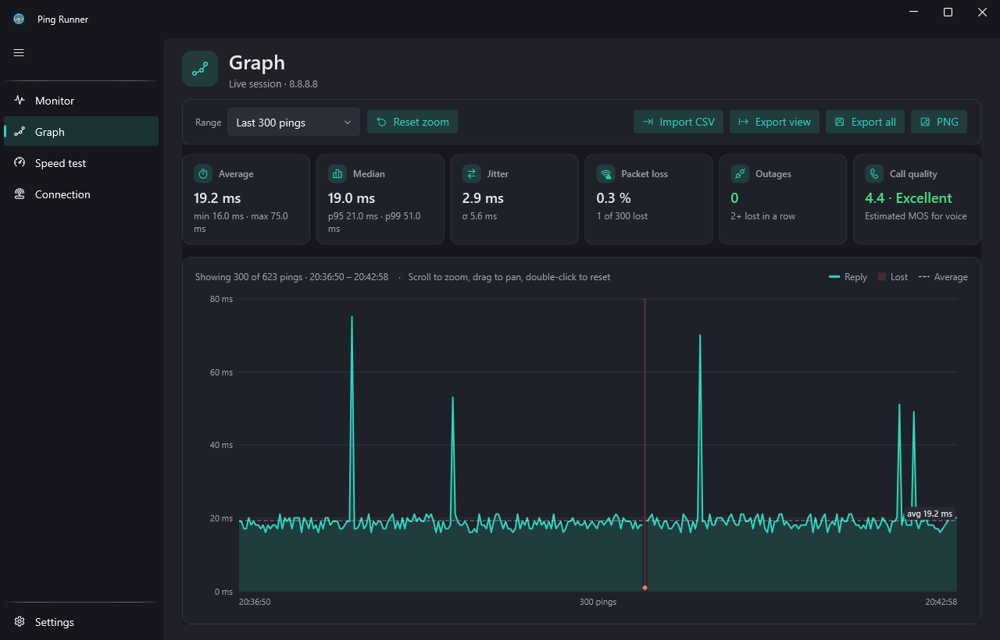
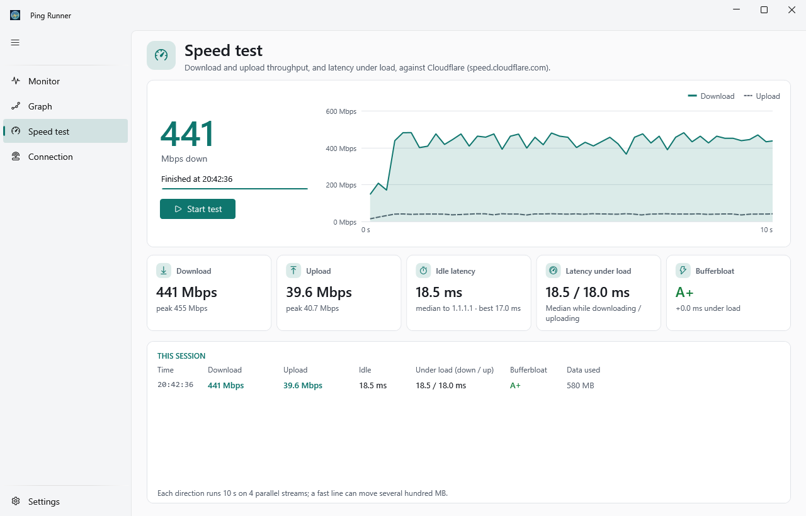
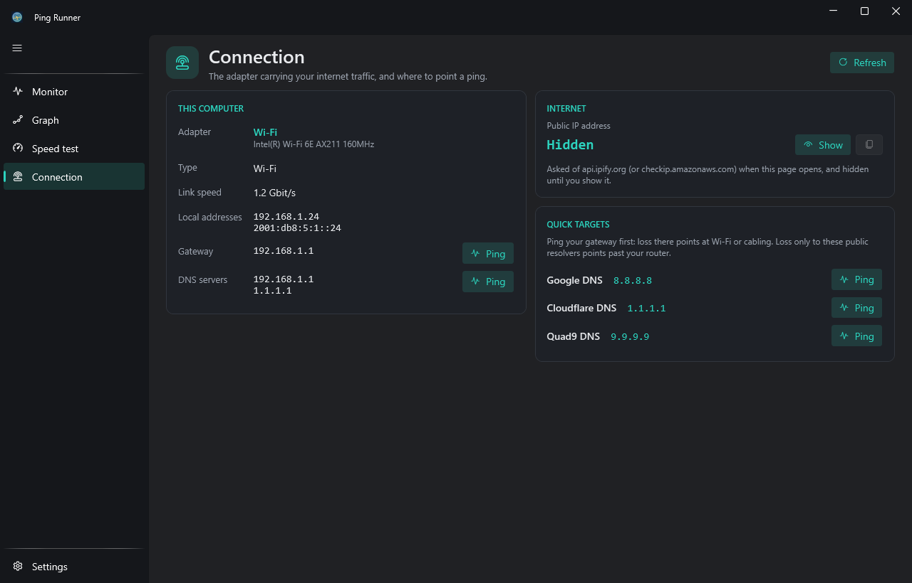
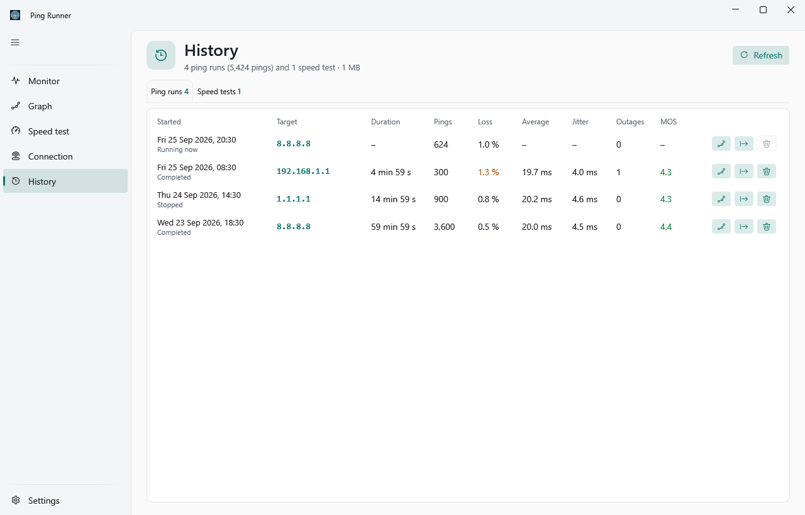
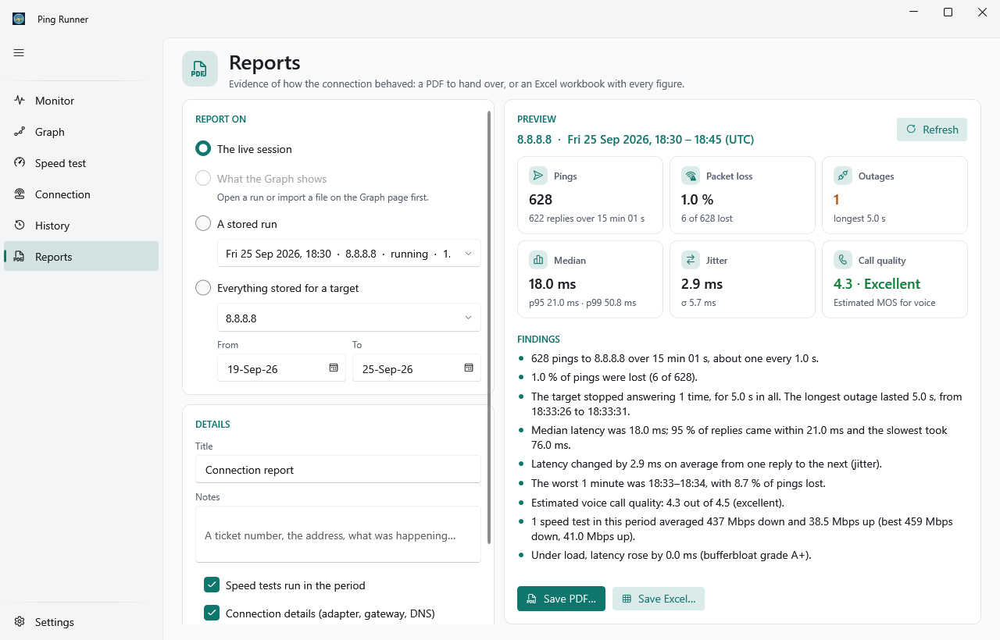
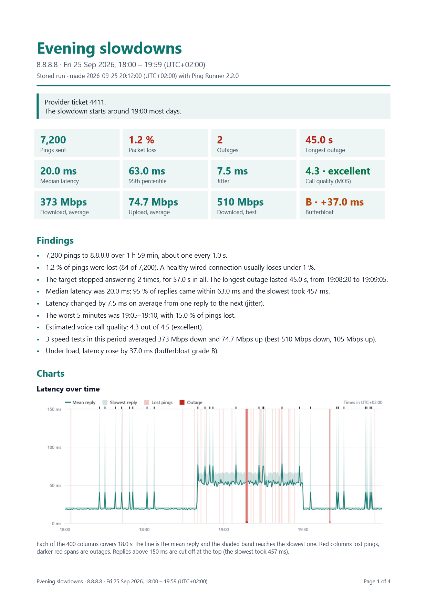

# Ping Runner

Ping Runner is a Windows app for finding out what is wrong with an internet connection. It pings a
host for as long as you like and shows latency, jitter, packet loss and outages as they happen, and it
runs a speed test that also measures how much a full line slows everything else down.



## Status

Version 2.2.0 is the current release. It adds reports as PDF and Excel, and imports from spreadsheets
and other tools into the History. Version 2.1.0 added the History page and a shortcut to your router's
admin page. Local builds report themselves as `2.2.0-dev`. Update from Settings:
"Check for updates" opens the release page, and the new installer replaces the old version in place,
keeping settings and history.

## What it shows

**Monitor.** Enter a host or IP, pick an interval, a timeout and how long to run, and start. Eight
figures update a few times a second:

| Figure | How it is worked out |
| --- | --- |
| Average latency | Mean round-trip time of the replies, with the fastest and slowest. |
| Median | Middle reply time, with the 95th and 99th percentiles (linear interpolation). |
| Jitter | Mean change in round-trip time between consecutive replies; lost pings in between are skipped. |
| Packet loss | Lost pings as a share of pings sent. Over 1 % turns amber, over 5 % red. |
| Call quality | A mean opinion score from 1 to 4.5, estimated with the simplified ITU-T G.107 E-model most network monitors use. A guide, not a measured call. |
| Outages | Runs of two or more lost pings in a row, with the longest. One lost ping is loss, not an outage. |
| Pings sent | Sent and received, and the time the session covers. |
| Worst spikes | Mean of the 50 slowest replies. |

The page also draws the last 120 pings and lists the newest 200. The copy button puts a text summary of
the session on the clipboard, ready for a support ticket.

**Graph.** The whole session, a stored run, or a file you import, narrowed to the last N pings or a
time span. Scroll to zoom at the pointer, drag to pan, double-click to reset, and hover for the exact
ping. The figures above the chart describe only what is on screen. Export the visible part or
everything as CSV, or the chart and its figures as PNG, or make a report of what it shows.



**Speed test.** Ten pings on an idle line, then ten seconds of download and ten of upload over four
parallel streams against Cloudflare's speed-test service, pinging 1.1.1.1 the whole time. The result
has the average rate and the best rate held for a full second, both leaving out the first second
while TCP ramps up, idle latency, latency under load and a bufferbloat grade from A+ to F. Length and stream count
are in Settings. A test on a fast line moves several hundred megabytes.



**Connection.** The adapter that carries the default route: type, link speed, local addresses, gateway
and DNS servers, each with a button that fills in the Monitor. "Open router" opens the gateway's admin
page (`http://<gateway>/`) in your browser. Ping the gateway first. Loss there
points at Wi-Fi or cabling; loss only to public hosts points past the router. The public IP is looked
up when the page opens and stays hidden until you show it.



**History.** Every ping run, with every ping in it, and every speed test, kept until you delete them.
A run is saved while it goes, every 50 pings or 5 seconds, so a crash loses at most a few seconds; a
run left open that way is marked "Interrupted" the next time the app starts. Open a run in the Graph,
make a report of it, export it as CSV, or delete it. Import adds pings from a file as stored runs, one
per target, marked with the file's name.



**Reports.** Evidence of how the connection behaved, for a support ticket or anyone who was not there.
Report on the live session, what the Graph shows, one stored run, or everything stored for a target
between two dates; add a title and notes; choose whether speed tests, connection details, the public IP
(off by default) and every ping go in. The page previews the figures and findings, then saves:

- a **PDF** to hand over: key figures, findings in plain words, charts of latency over time (lost pings
  and outages marked), loss per slice of time, how replies were spread and the speed tests, a table
  over time, every outage, the speed tests, the connection and how it was all measured;
- an **Excel workbook** to work with: the same summary and charts, then a sheet per table with real
  numbers and dates, and a Pings sheet that imports straight back into Ping Runner.





**Import.** The Graph and the History read Ping Runner's CSV, the same file after a spreadsheet saved
it again (semicolons or tabs, local dates, decimal commas), other tools' ping logs with a time column
and a latency or result column, and Excel workbooks. Rows that cannot be read are left out and listed
by line; a file with no pings in it is refused with the reason.

**Settings.** Light, dark or Windows theme, four accent colors, how many pings the live session keeps
(10,000 to 500,000), speed-test length and streams, backup, restore and clearing of the history, and an
update check.

There is also a console version: `pingrunner` asks for a host and prints each ping and a summary, and
`pingrunner speed [seconds] [streams]` runs the speed test.

## Requirements

- Windows 10 or 11, x64. The installer brings its own .NET runtime.
- Some networks and hosts drop ICMP. When a host never answers, every ping shows as lost; try another
  target such as your gateway.
- To build: the .NET 10 SDK. To build the installer: Inno Setup 6.

## Install

Download `PingRunner-<version>-setup.exe` and its `.sha256` from the
[Releases](https://github.com/lukr-99/ping-runner/releases) page, check the hash, and run it. It
installs for the current user only, without administrator rights, to
`%LOCALAPPDATA%\Programs\Ping Runner`. The installer is not code-signed yet, so Windows SmartScreen
may warn before it runs.

```powershell
(Get-FileHash .\PingRunner-2.0.0-setup.exe -Algorithm SHA256).Hash.ToLower()
```

To build the installer yourself, see [Delivery](#delivery).

## Build and test

From the repository root:

```powershell
dotnet build PingRunner.slnx -c Release
dotnet test --solution PingRunner.slnx -c Release
dotnet run --project src\PingRunner.App\PingRunner.App.csproj
```

The tests need no network beyond loopback ping. [CONTRIBUTING.md](CONTRIBUTING.md) has the full
check that CI runs, and how to regenerate the screenshots above.

## Architecture

Four projects with dependencies pointing inward: `PingRunner.Core` (statistics, the ping loop, the
speed test, reports, file formats; no I/O), `PingRunner.Infrastructure` (ICMP, HTTP, the adapter list,
the settings file, the history, PDF and Excel), `PingRunner.App` (WPF UI and the composition root) and
`PingRunner.Cli`. See
[ARCHITECTURE.md](ARCHITECTURE.md) for the seams, the data flow and the outside services the app talks
to, and [CONTEXT.md](CONTEXT.md) for what each measurement means.

## Data safety

Ping Runner keeps two files in `%LOCALAPPDATA%\PingRunner` (`PingRunner Dev` for `-dev` builds).
Uninstalling leaves the folder; deleting it resets the app.

- `settings.json` holds appearance, the last ping form and recent targets, with a `Version` field for
  later migrations. A settings file that cannot be read is kept as `settings.unreadable.json` and the
  app starts on defaults.
- `history.db` (SQLite) holds every ping run with its pings and every speed test. Its schema changes
  only through numbered migration files, and a history written by a newer Ping Runner is left alone
  rather than opened. A file SQLite cannot read is set aside as `history.unreadable-<time>.db` and a
  new history starts.

Back up the history from Settings: it writes a complete copy to a file you choose. Restore checks that
the file is a readable Ping Runner history before it replaces anything and keeps the previous one as
`history.before-restore.db`. A single run can also go out as CSV, in the format 1.x wrote, or as a
report; CSV files and Excel workbooks open in the Graph or import into the History.

## Delivery

The version lives in [Version.props](Version.props). Every build is `-dev` unless it is made with
`-p:PingRunnerReleaseBuild=true`, which only the installer script and the release workflow do.

```powershell
.\installer\build-installer.ps1        # release installer, installer\dist\PingRunner-2.0.0-setup.exe
.\installer\build-installer.ps1 -Dev   # the same, versioned 2.0.0-dev
```

Pushing a `v2.0.0` tag runs the release workflow, which checks the tag against `Version.props`, runs
the tests, builds the installer and its checksum, and drafts a GitHub Release. The steps before and
after are in [docs/releasing.md](docs/releasing.md). The in-app update check only reads the newest
published release and offers to open its page; it never downloads or runs anything.

## License

[PolyForm Noncommercial 1.0.0](LICENSE.md). Free for personal and other noncommercial use; selling it
or using it commercially needs permission. The libraries it ships with are listed in
[THIRD-PARTY-NOTICES.md](THIRD-PARTY-NOTICES.md), which the installer puts beside the app.
